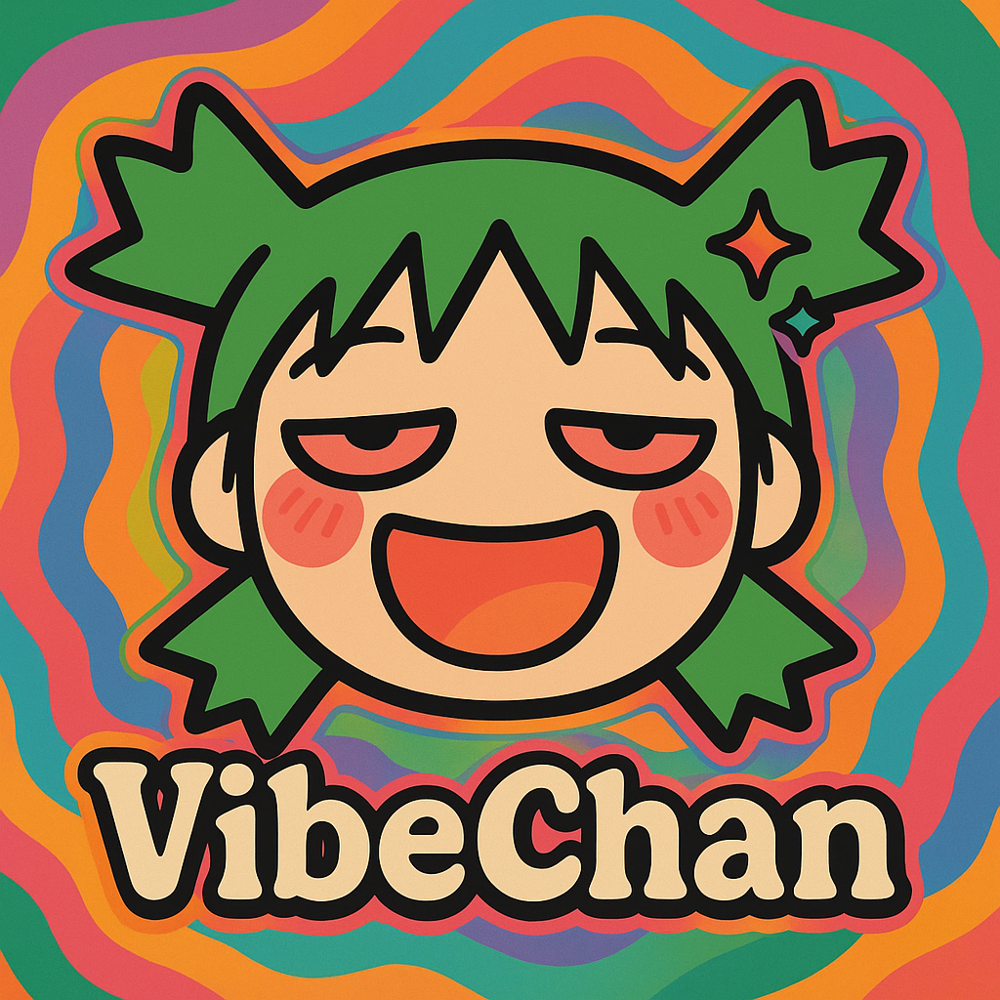

  
  
  

# 🌀 VibeChan

> _Chana is dead, long live VibeChan!_ _(new logo is ai generated btw)_

**VibeChan** is a reimagining of [**Chana**](https://apkpure.com/chana-superior-4chan-reader/com.basedorg.chana), the beloved imageboard viewer app — now reborn through pure chaotic creativity, AI hallucinations, and ✨vibes✨.

This is not just a rewrite. This is a **vibecoded resurrection**. We're building the new version using only AI tools, in a flow we call **vibecoding**.

---

## 🌈 What's VibeChan?

A collaborative weekend-ish project where the only goal is to create *something fun*, powered entirely by AI-generated code. You don’t have to understand what the code does. You don’t even have to write it.

You just:
- See stuff  
- Say stuff  
- Run stuff  
- Copy/paste stuff  

LLMs do the rest.

---

## 📖 A Brief History

- 🪦 **Chana**: A comfy imageboard viewer app. Sleek. Loved. Coded by hand.  
- 🌀 **VibeChan**: A full-on AI-coded reincarnation. Dripping in vibes. Guided by hallucinations and half-baked ideas spoken into SuperWhisper.

---

## 🧠 What Is Vibecoding?

> There's a new kind of coding I call "vibe coding", where you fully give in to the vibes, embrace exponentials, and forget that the code even exists...  
> I just see stuff, say stuff, run stuff, and copy paste stuff, and it mostly works.

– *A certified Vibecoder*

In short:  
🗣️ You talk to LLMs.  
🧠 You don’t read diffs.  
🪄 You accept everything.  
💥 You prompt until bugs disappear.

It’s coding, without the coding. And it’s amazing.

---

## 🚫 Rules of the Repo

**NO human-authored code.**  
You must use LLMs to contribute. Always.

You can use:
- Cursor + Composer  
- Copilot  
- ChatGPT / Claude / Gemini  
- Whisper + Voice  
- Or anything else that writes code for you  

Just don't manually write logic. That’s illegal here.

---

## 🛠️ How To Contribute

**New to VibeChan?**  
Check out our [CONTRIBUTORS.md](CONTRIBUTORS.md) file to get an overview of the project architecture and learn how everything works!

1. Fork the repo  
2. Fire up your favorite AI coding environment  
3. Prompt your way into a new feature, fix, or chaos  
4. Submit a PR  
5. Extra flair if your commit messages are also vibecoded

📝 **Need prompt ideas?**  
Check out [`prompts.txt`](prompts.txt) for actual examples of vibecoding in action.

---

## 🗺️ Roadmap (If You Can Call It That)

- [ ] Turn VibeChan into a usable imageboard viewer  
- [ ] Reach peak vibes

---

## 💌 Join the Movement

VibeChan isn't just an app — it's a state of mind.

Come contribute. Come hallucinate.  
**Come vibecode.**
